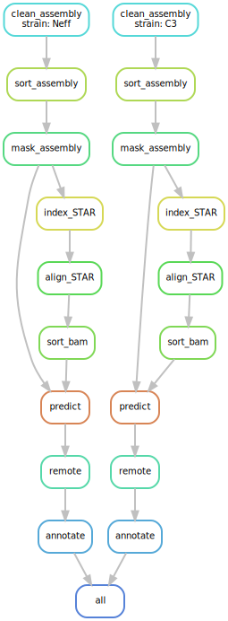

## Acanthamoeba castellanii genome annotation
*cmdoret, 20190905*

This pipeline allows to reproduce the automatic annotation procedure used for he A. castellanii genome assembly. Most of the work is done using funannotate. Each step of the pipeline is run inside a singularity container. The only dependencies are python 3, snakemake and singularity.

There are 3 configuration files:
  * config.yaml: General pipeline parameters as well as path to the output and temporary folders.
  * samples.tsv: Assemblies to annotate.
  * units.tsv: Describes input reads files to use for evidence during annotation.

The pipeline works as follows:
  1. Clean the input assembly (rename headers, sort and filter scaffolds)
  2. Soft mask repeats from the assembly
  3. Use RNAseq data to predict genes with AUGUSTUS
  4. Use remote services for functional annotations
  5. Combine functional annotations from different sources.

NOTE: For now, RNAseq is used only for training AUGUSTUS. When RNAseq from C3 will be available, the de-novo assembled transcriptome will be used as direct evidence for both strains.

