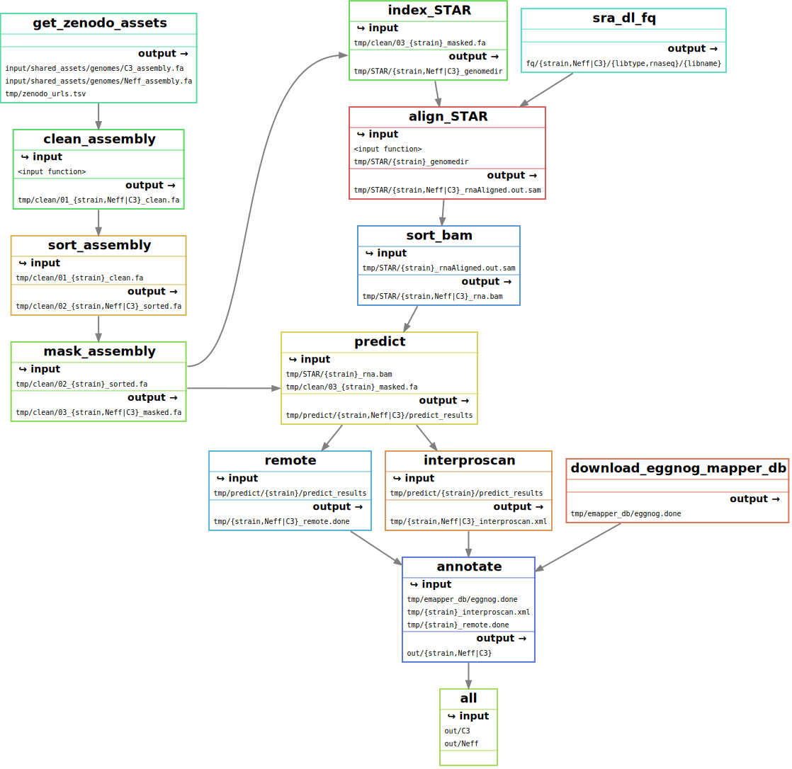

## Acanthamoeba castellanii genome annotation
*cmdoret, 20190905*

This pipeline allows to reproduce the automatic annotation procedure used for the A. castellanii genome assembly. Most of the work is done using [funannotate](https://github.com/nextgenusfs/funannotate). Each step of the pipeline is run inside a singularity container. The only dependencies are python>=3.7, funannotate, snakemake and conda.

### Configuration

There are 3 configuration files:
  * `config.yaml`: General pipeline parameters as well as path to the output and temporary folders.
  * `samples.tsv`: Assemblies to annotate.
  * `units.tsv`: Describes input reads files to use for evidence during annotation.

### Installation

You need to install funannotate in conda and follow the instructions to setup the dependencies and $FUNANNOTATE_DB.
Snakemake and conda are also required to run the pipeline. 

[Eggnog-mapper](https://github.com/eggnogdb/eggnog-mapper/wiki/eggNOG-mapper-v2#Installation) and [interpsoscan](https://github.com/ebi-pf-team/interproscan/wiki/HowToDownload) should also be installed on the system as they will be used by funannotate to improve the annotations.

### Usage

If you funannotate is available in your cuurrent conda environment, you can the pipeline with the following command:
```bash
snakemake --use-conda -j4
```

### Description

The pipeline works as follows:
  0. Download the assemblies from zenodo and rnaseq reads from SRA
  1. Clean the input assembly (rename headers, sort and filter scaffolds)
  2. Soft mask repeats from the assembly
  3. Use RNAseq data to predict genes with AUGUSTUS
  4. Use remote services for functional annotations (Eggnog-mapper, interproscan, phobius) 
  5. Combine functional annotations from the different sources.



